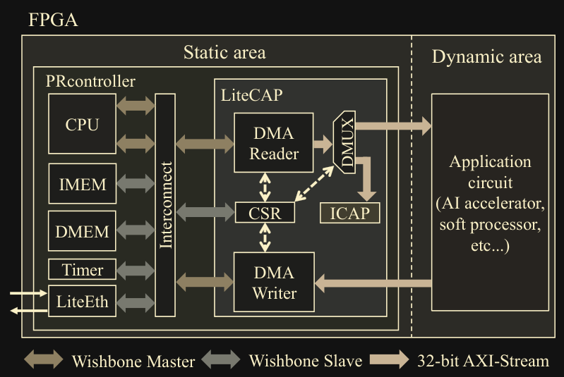
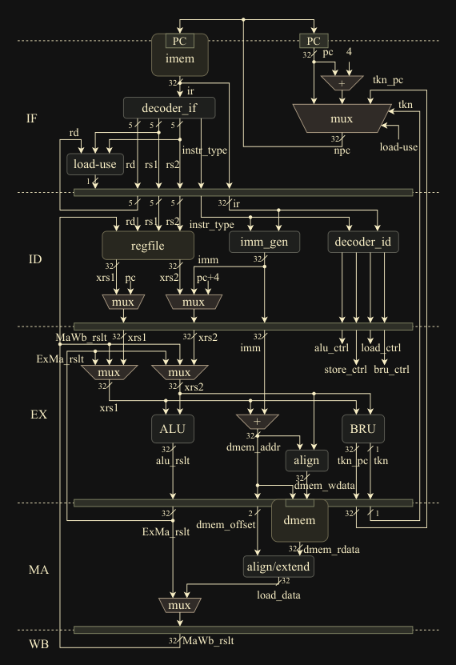
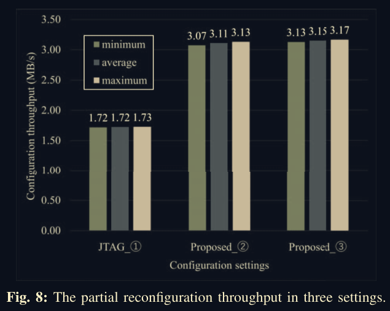

# **HaaS with Remote Partial Configuration**

A Remote Partially Reconfigurable RISCV Soft Processor on a Low end FPGA

---

# Table of Content

- [Introduction](#introduction)
- [Technical](#technical)
- [Similar Work](#similar-works)
- [The Proposal](#the-proposal)
- [Verification](#verification)
- [Conclusion](#conclusion)
- [Links](#links)

---

# Introduction

- Imagine a data center with a massive stack of FPGAs providing HaaS
- To efficiently use FPGAs, we need virtually no downtime
- Partial reconfiguration provides an optimal solution to such a venture
- There are some roadblocks to utilise such an architecture efficiently

---

# Contd.

- To implement partial configuration on an FPGA, the usual approach is to pair the FPGA fabric with a processor (like ARM cortex / RISCV core) as a controller
- This increases the cost of individual Units $\therefore$ affecting scalability
- Alternatively we can have the FPGA fabric separated and controlled via JTAG cables and the server acting as the controller
- But this is unfeasible because the partial bitstreams are sensitive to noise which is excarcebeted along long distances
- The solution proposed in this paper is to divide the FPGA fabric into dynamic and static regions and implement the PR (Partial Reconguration) Controller in the static partition

---

# Technical

## Partial Bitstreams

- Partial bitstreams are the bitstreams created by the EDA tool to implement Partial Configuration on an FPGA
- After compatibility checks with the static modules. This file is then configured onto the FPGA fabric using ICAP (Internal Configuration Access Point)

## LiteX

- Generates a source code for a riscv soft core
- This SoC can be implemented in any FPGA

---

# Similar Works

## REoN

A network partial configuration framework that was apt for high end FPGAs. (Not suitable for low end FPGAs)

## Hardware implementation of TCP/IP stack

But this module takes significant FPGA resources, which are limited in low end FPGAs

---

# The Proposal

- Partition the FPGA fabric into static and dynamic sections
  - Static partition will contain the PR controller
  - Dynamic partition will contain the application circuit
- 2 TCP connections during operation between host and FPGA
  - One for sending the partial bitstream
  - Another to send the data to the application circuit after configuration

---

# Verification

## Environment

- Board used -> Arty A7-35T FPGA
- riscv64-unknown-elf-gcc 12.2.0
- LiteX
- VexRiscv -> RV32I

## Tests

- [CNN Network as Application Circuit](#cnn-network-as-application-circuit)
- [RISCV Soft Processor as Application Circuit](#riscv-soft-processor-as-application-circuit)

---

## CNN Network as Application Circuit

- A handwriting classification model
- Database $\rightarrow$ MNIST
- NN inference framework used to implement the CNN on FPGA $\rightarrow$ FINN

---

## RISCV Soft Processor as Application Circuit

- In-order execution model written in Verilog
- A Hello world program with output given to AXI-Stream interface

---

# Verification Results

- To verify the reliability of the proposed SoC in real world applications, they connected the SoC and host PC to the laboratory LAN
- While sending the partial bitstreams continuously, 100 different MNIST images were send for inferencing. The result matched the HDL simulations
- Similarly for the soft core, while sending the partial bitstreams continuously, and sending the instructions for the "Hello, World!" program. There was no error under rigorous testing

---

# Evaluation Results

### Resource Utilisation

- CPU - With a CPU on board the FPGA
- REoN - Network protocol for partial configuration on high end FPGAs
- PR Controller - The static partition of our SoC

---

# Evaluation Results

### Throughput for different configurations

- 2MB CNN accelerator partial bitstream including headers
- 2MB CNN accelerator partial bitstream starting with sync word
- 10MB CNN accelerator partial bitstream with 8 MB zero padding

---

# Conclusion

- We use a stripped down version of other protocols and modules to fit it into a low end fpga with limited resources (Zynq vs Arty FPGA boards)
- The above proposal is suitable for datacenters and NFV (Network Function Virtualisation)
- The above SoC removes the need for an external CPU/ Controller that is usually used with partial reconfiguration of FPGAs. Making each FPGA standalone. Therefore more scalable

---

# Links

## Paper

- [The Main Paper](https://ieeexplore.ieee.org/abstract/document/10387925)

## Related Papers

- [REoN Protocol](https://ieeexplore.ieee.org/abstract/document/7857184)
- [Limago: An FPGA-Based Open-Source 100 GbE TCP/IP Stack](https://ieeexplore.ieee.org/abstract/document/8891991)
- [Scalable TCP/IP Stack Architecture for Reconfigurable Hardware](https://ieeexplore.ieee.org/abstract/document/7160037)
- [IwIP](https://ieeexplore.ieee.org/abstract/document/10387925)
- [RV CAP](https://ieeexplore.ieee.org/abstract/document/9460688)

---

# Questions to ask
- How do data centres actually implement FPGA access like AWS e2c?
- Is it possible to make a full blown application for FPGA based HaaS that can be implemented in the industry?
  - Is it worth it?
  - Has something like this been implemented before?

---

# **Thank You**
