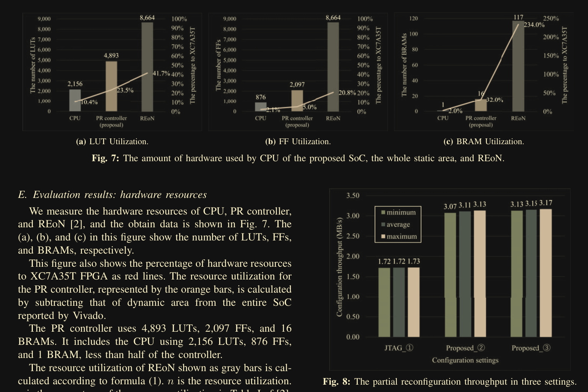

# SoC RISC-V soft processor
> [!NOTE]
> ###### Source: [Paper](../Sources/A_remote_partial-reconfigurable_SoC_with_a_RISC-V_soft_processor_targeting_low-end_FPGAs.pdf)
> ###### Status: Finished
> ###### Author: Pranav
> ###### Keywords: 
>   - RISCV
>   - SoC

## Table of Content
- [SoC RISC-V soft processor](#soc-risc-v-soft-processor)
          - [Source: [Paper](../Sources/A_remote_partial-reconfigurable_SoC_with_a_RISC-V_soft_processor_targeting_low-end_FPGAs.pdf)](#source-papersourcesaremotepartial-reconfigurablesocwitharisc-vsoftprocessortargetinglow-endfpgaspdf)
          - [Status: Not Started](#status-not-started)
          - [Author: Pranav](#author-pranav)
          - [Keywords:](#keywords)
  - [Topic](#topic)
  - [Questions](#questions)
  - [Notes](#notes)
    - [Introduction](#introduction)
      - [Principle](#principle)
      - [Achievements](#achievements)
    - [Technical](#technical)
      - [Partial Bitstreams](#partial-bitstreams)
      - [LiteX](#litex)
    - [Related Work](#related-work)
    - [The Proposal](#the-proposal)
      - [Hardware Implementation](#hardware-implementation)
      - [LiteCAP](#litecap)
    - [Verification](#verification)
      - [Environment](#environment)
      - [CNN Network as Application Circuit](#cnn-network-as-application-circuit)
      - [RISCV Soft Processor as Application Circuit](#riscv-soft-processor-as-application-circuit)
      - [Verification of SoC](#verification-of-soc)
      - [Evaluation Results: Hardware Usage](#evaluation-results-hardware-usage)
      - [Evaluation Results: Processing time and Throughput](#evaluation-results-processing-time-and-throughput)
  - [Conclusion](#conclusion)
  - [Extra Sources](#extra-sources)

## Topic
Remote Partial Reconfigurable RISCV Soft Core for Edge Computing

## Questions
- Why is long distance JTAG not feasible?
  - Reliabitly
  - Timing

## Notes
### Introduction
#### Principle
- We need an external controller to configure a fpga remotely. This controller is connected to the FPGA fabric via JTAG cable.
- This results in extra cost. To deal with this, we use partial reconfiguration to synthesis a controller on the static partition of the fpga fabric
- The fpga fabric is paritioned into dynamic reconfigurable and statically reconfigurable partitions
- This controller then controls the reconfigurable partition of the fpga fabric

#### Achievements
- Send partial bitstream over TCP connection and the static part of the fpga fabric (the controller) programs the dynamic portion
- Two verification methods
  - CNN accelerator for MNIST
  - Soft core with reconfigurable stages
- Better network throughput compared to JTAG PR

### Technical
#### Partial Bitstreams
- Contains:
  - Header
    - metadata of FPGA model
  - Sync word
    - 32 bit magic number - `0xAA995566`
  - Instruction sequence
    - Address of configuration memory
    - Values to be written at the addresses
- Is programmed using the ICAP (Internal Configuration Access point)

#### LiteX
- Generates a source code for a riscv soft core
- This SoC can be implemented in any FPGA

### Related Work
- REoN - A network partial configuration framework that was apt for high end FPGAs. (Not suitable for low end FPGAs)
- Hardware implementation of TCP/IP stack. But this module takes significant FPGA resources, which are limited in low end FPGAs

### The Proposal
- Partition the FPGA fabric into static and dynamic sections
  - Static partition will contain the PR controller
  - Dynamic partition will contain the application circuit
- 2 TCP connections during operation between host and FPGA
  - One for sending the partial bitstream
  - Another to send the data to the application circuit after configuration
- They perform PR for each TCP segment that was received instead of on the whole file. This reduces the buffer size

#### Hardware Implementation
- PR controller handles PR, data transfer, network communication
  - To reduce FPGA resources, protocol stack is implemented by software (implemented by [IwIP](https://ieeexplore.ieee.org/abstract/document/10387925))
  - Soft core -> VexRiscv
- Doesn't implement a complete OS. Instead uses C in the software
- LiteEth handles sending and receiving frames
- BRAMs are used for IMEM, DMEM, buffers of LiteEth

#### LiteCAP
- Reference -> [RV CAP](https://ieeexplore.ieee.org/abstract/document/9460688)
- Elements
  - DMA Reader
  - DMA Writer
  - CSR (Configuration and Status Register)
  - DMUX (de-multiplexor)
  - ICAP
- (They talk about what is implemented through the network protocol)

### Verification
#### Environment
- Board used -> Arty A7-35T FPGA
- Vivado v2022.2
- lwIP 2.1.3
- riscv64-unknown-elf-gcc 12.2.0
- LiteX
- VexRiscv -> RV32I
- Total on chip memory -> 40KB

#### CNN Network as Application Circuit
- Database -> MNIST
- NN accelerator framework -> FINN

#### RISCV Soft Processor as Application Circuit
- In-order execution model written in Verilog
- A Hello world program with output given to AXI-Stream interface

#### Verification of SoC
- Connected the SoC to the LAN of the laboratory to introduce noise in the network
- 100 differenet MNIST images are sent 100 times to the SoC while partial bitstreams are send to the FPGA continuously
- The inference value matches from the HDL simulations
- Similar results for the soft processor test

#### Evaluation Results: Hardware Usage

#### Evaluation Results: Processing time and Throughput

## Conclusion
- We use a stripped down version of other protocols and modules to fit it into a low end fpga with limited resources (Zynq vs Arty FPGA boards)
- The above proposal is suitable for datacenters and NFV (Network Function Virtualisation)
- The above SoC removes the need for an external CPU/ Controller that is usually used with partial reconfiguration of FPGAs. Making each FPGA standalone. Therefore more scalable

## Extra Sources
- [REoN Protocol](../Sources/REoN_A_protocol_for_reliable_software-defined_FPGA_partial_reconfiguration_over_network.pdf)
- [IwIP](https://ieeexplore.ieee.org/abstract/document/10387925)
- [RV CAP](https://ieeexplore.ieee.org/abstract/document/9460688)
