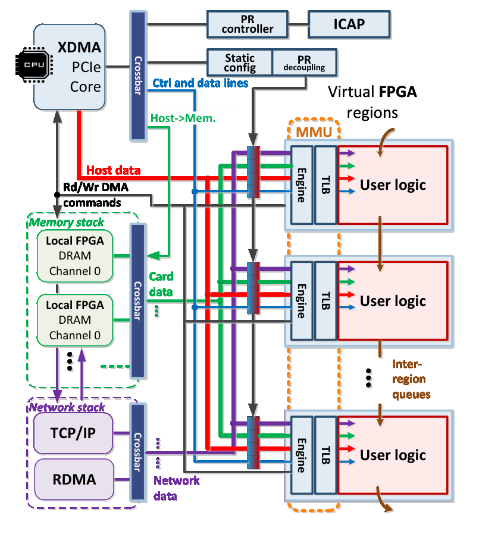
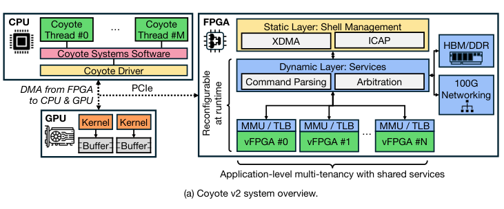
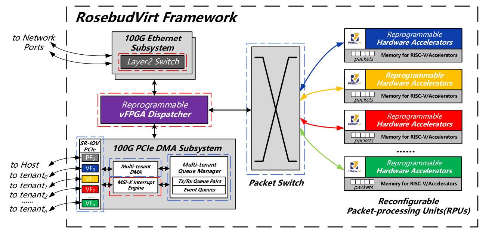
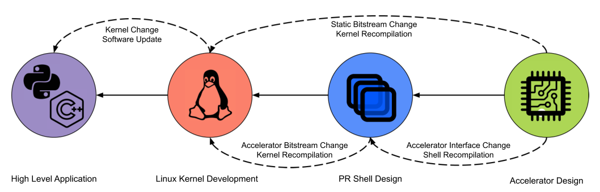
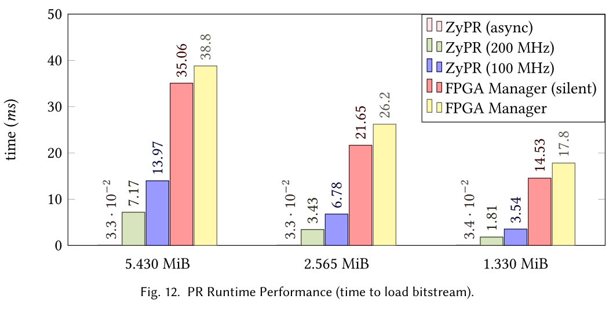

# **State Of The Art Research for DPR**

An overview into most recent, relevant research into Dynamic Partial Reconfiguration

> By _Arun I, Pranav Varkey, Shrikrishna Pandit_

---

# Table of Content

- [Vendor Tools](#vendor-tools)
- [Applications](#applications)
  - [Cloud](#cloud)
    - [Coyote](#coyote)
    - [RosebudVirt](#rosebudvirt)
  - [Security](#security)
    - [RandOhm](#randohm-mitigating-impedance-side-channel-attacks)
- [Toolflows](#toolflows)
  - [Hierarchical Partial Reconfiguration](#fast-and-flexible-fpga-development-using-hierarchical-partial-reconfiguration)
  - [ZyPR](#zypr)
- [Other Papers](#others-paper)

---

# **Recap**

#todo

- PR Architecture (3) - arun
- Toolflows (3) - sk

---

- Applications - ptv

---

# **Vendor Tools**

- AMD
- Intel

---

## AMD

- DFx Controller IP → Manages PR events, pulls bitstreams to ICAP, handles decoupling, and controls RM shutdown via AXI interfaces.
- DFx Decoupler → Provides interface isolation between static and reconfigurable regions to prevent glitches during PR.
- DFx Shutdown Manager → Safely disables clocks and stops RM transactions to ensure a clean reconfiguration process.
- DFx Bitstream Monitor → Tracks bitstreams flowing through the design for debugging and verification.

> Source: AMD Documentation (link)

---

## Intel

- Hierarchical Partition Reconfiguration → Allows parent RMs to manage child RMs under a static region for modular PR.
- Static Update Reconfiguration → Enables updates to specialized static regions without full design recompilation.
- PR Bitstream Validation → Checks that RMs only occupy authorized FPGA areas.
- PR Bitstream Authentication → Verifies firmware and bitstreams are from trusted, authenticated sources.
- PR Bitstream Compression/Encryption → Reduces and secures bitstream size and content for efficient, protected loading.

---

# **Applications**

## Cloud

---

### **Coyote**

This paper applies ideas from operating systems design to FPGA resource allocation, sharing, isolation, and management.

<!-- This can help mitigate the complexity and security concerns related with using FPGAs in datacenters. At the same time improving the flexibility for multi tenant applications -->

#### Use of Partial Reconfiguration (PR):

- Coyote uses Partial Reconfiguration for configuring services and switching out user logic
- This paper sets the context for the importance of FPGAs in modern data centers and the challenges associated with their integration and management

---

#### Contribution from V2

- Coyote is a open source FPGA shell to raise the level of abstraction for FPGAs and provides similar interface to those found in GPUs DPUs TPUs
- FPGA Shell - Shell is like a empty box that has interfaces and infrastructure like PCIe DMA clocks etc, Its a static part inside which any custom design can be implemented
- Coyote V2 addresses 3 requirements -
  - Reusable & Reconfigurable Services
  - Multi- tenancy , PR and Multi-threading
  - Unified and generic application interface

---

- Coyote Layers
  - Static Layer
    - CPU-FPGA link - Shell Control
      - Host Streaming Channel ,Migration Channel (migration buffers)
      - Utility Channel
    - Device Drivers
    - Reconfiguration controller - ICAP controller
  - Dynamic Layer
    - Memory Management - to manage TLB misses etc, and PCIe Controller HBM controller etc
    - Networking RoCE v2 BALBOA compliant networking stack
    - Multi-Tenant Fair Sharing - Packetization , interleaving , and credit based system for all data requests from FPGA or from host
  - Application Layer
    - Generic Application interface -
    - Untrusted Application and Crediting
      - Memory isolation between multi tenants
      - Credit system to tackle Back pressure and deadlocks
      - Software APIs - multi threading with isolation to provide access to multi-tenant users
- Runs On Xilinx Vivado

---

### **RosebudVirt**

- Original Rosebud framework provided an acceleration framework for network functions by partitioning FPGA fabrics into Reconfigurable Packet-Processing Units (RPUs) to handle significant traffic with low latency
- This paper introduces virtualization of the available IO ports to enable multi-tenancy via h/w (SR-IOV) rather than through scheduling via s/w (which gives poorer performance)

#### Use of Partial Reconfiguration (PR):

- PR is employed to enable dynamic allocation, isolation, and management of FPGA resources among multiple networks sharing the FPGA resources via RPUs
- The back bone of this architecture is Dynamic Function Exchange, AMD's approach to PR

<!--
Its compatibility with cluster management tools like Kubernetes and Docker suggests practical relevance for cloud deployment.
-->

---

# **Toolflows**

---

## **Fast and Flexible FPGA Development using Hierarchical Partial Reconfiguration**

- Vendor tools perform a monolithic placement and routing process with limited parallelism, failing to fully exploit modern multi-core CPUs or cloud computing power.
- Existing methods like RapidStream and prior work using Partial Reconfiguration (PR) with Network-on-Chip (NoC) map user designs onto fixed-sized regions or "pages".
  - Manually decompose designs into components that fit these fixed sizes
  - Can result in suboptimal performance
  - Using large fixed pages reduces the potential compilation speedup benefits

---

### Hierarchical Partial Reconfiguration (HPR) Framework

- Build upon an open-source framework that uses PR for separate compilation and a pre-built NoC for operator communication
- HLS and synthesis for each operator run in parallel
- After synthesis, the tool automatically assigns an appropriate variable-sized PR page based on resource utilization reports. Users are not forced to decompose their designs to fit fixed pages
- Separate place/route/bitstream generation jobs are launched in parallel
- Partial bitstreams are loaded together. The NoC facilitates connections without slow global stitching

---

### Results and Impact

- Demonstrated on Xilinx ZCU102 Platform. Evaluated using the Rosetta HLS benchmarks
- The system with variable-sized pages achieves 1.4–4.9× improved application performance compared to a system using only fixed-sized pages.
- framework compiles applications 2.2–5.3× faster than the vendor tool
- Compilation times are typically 2–5 minutes, compared to 7–22 minutes for Vitis monolithic flow
- The flexibility of variable-sized pages supports incremental refinement scenarios, allowing users to optimize operators (inter-operator merging, intra-operator unrolling) while the system adapts page assignments

---

## **ZyPR**

This paper introduces ZyPR, presented as an end-to-end build tool and runtime manager specifically for Partial Reconfiguration (PR) on FPGA SoCs at the Edge.

### Requirements of Auomated Toolflow for PR

- Determine compatibility of PR modules and the static regions;
- Generate PR configurations based upon a user supplied config file;
- Export PR configurations (memory maps, bitstreams, register values) to a Linux image;
- Implement runtime abstractions that allow software-centric control of hardware state;
- Support non-PS centric data generation/acquisition.

---

### Use of Partial Reconfiguration (PR):

- ZyPR supports generating PR infrastructure using shared DMA resources, facilitates loading partial bitstreams, and includes features like chained region generation for connecting multiple accelerators. The tool is designed to simplify the complex process of PR, which traditionally involves propagating changes across hardware and software layers.
- ZyPR contributes to making PR more accessible and manageable, particularly for FPGA SoCs used in edge computing
- Increasing the provisioning throughput for PR bitstreams on the Zynq Ultrascale+ by 2× and 5.4× compared to Xilinx’s FPGA Manager

---

# **Others Paper**

- ACNNE: Convolution Engine for CNNs using Partial Reconfiguration on FPGAs
- Reconfigurable Hardware Acceleration For ROS - Based Robotics Applications
- Architectures
  - AMPER-X: Adaptive Mixed-Precision RISC-V Core
  - DFX To Redefine RISC-V Multicore Architectures at Runtime
  - FPGA Overlays Targeting Data Flow Applications
- IPs
  - Dora: A Low-Latency Partial Reconfiguration Controller
  - RV-CAP: DPR for FPGA-Based RISC-V System-on-Chip

---

- Cloud
  - DML: Dynamic Partial Reconfiguration With Scalable Task Scheduling for Multi-Applications on FPGAs
  - System Architecture for Network-Attached FPGAs in the Cloud using Partial Reconfiguration
  - Dynamic Resource Management in Reconfigurable SoC for Multi-Tenancy Support
- Security
  - Mitigating side channel attacks on FPGA through DL and DPR
  - Partial Reconfiguration for Fault Injection in FPGA Fabrics
  - Error detection and recovery in MPSoCs using Hypervisor and DPR
  - RandOhm

---

# **Thank You**
